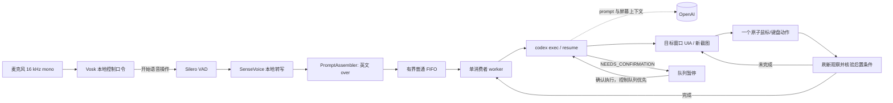
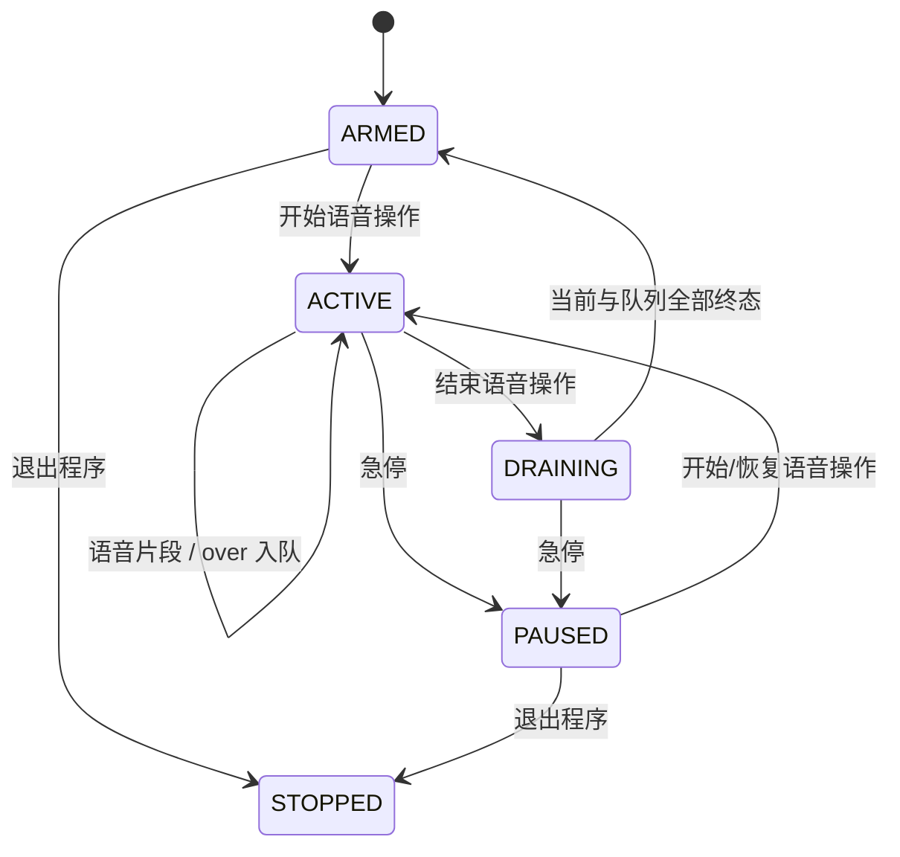

# HandsFreePC 架构

## 目标与非目标

HandsFreePC 是 Windows 11 用户会话中的本地优先语音控制器。0.2 的主流程是：双手被占用时，说“开始语音操作”进入连续会话，以英文 `over` 分隔多条指令，在继续收音的同时把完整 prompt 按 FIFO 交给 Codex Computer Use；控制提示要求它在每个桌面动作后刷新观察并自检任务相关后置条件。

它不是远程桌面、管理员提权工具或无人值守的通用 RPA 平台。控制提示要求 Computer Use worker 采用选定目标窗口、单动作、刷新、自检的闭环，并禁止终端/Run 对话框、ChatGPT/Codex UI、认证、密码、UAC 和安全/隐私设置；这不是本地 capability sandbox。模型和插件仍可能犯错；0.2 尚未完成真实屏幕 Computer Use 验收，不能把 prompt 约束写成已经由 live test 证明的保证。

## 总体数据流



Computer Use 关闭时保留 0.1 兼容链路：确定性 parser，或显式双重开启的 Codex/Claude 文本 planner，经过 JSON Schema、本地安全策略与旧 Windows/UIA 白名单执行器。该 planner 与新的 Computer Use controller 是两个不同组件，不能混用安全声明。

原始音频只进入本机内存和本地模型。连续 Computer Use 必须同时满足 `computer_control.enabled: true`、`privacy.allow_cloud_planner: true`、`computer_control.allow_screen_context_to_cloud: true` 和 `execution.dry_run: false`；启用后，识别的 prompt、窗口元数据、辅助功能树、目标窗口截图、可见内容和剪贴板状态可能由 OpenAI 处理。公开 `config.example.yaml` 默认关闭前三项并保留 `dry_run: true` 与 `speech.fallback.backend: none`；只应在不提交 Git 的 `config.local.yaml` 中显式启用。`dry_run` 主要约束兼容执行器，但配置加载器也用它阻止在名为 dry-run 的配置中误启真实 Computer Use；它不是 Computer Use 的能力沙箱。

## 设计不变量

这些约束比任何单个模型或 UI 选择器更重要：

1. **控制口令本地优先。** Vosk 常开 grammar 识别开始、结束输入、急停、确认和恢复。`phrase_window_seconds` 允许慢速口令跨多个 final 聚合，但它不是声纹认证。
2. **连续收音与执行解耦。** PromptAssembler 只在独立英文单词 `over` 处完成 prompt；`mouseover` / `voiceover` 不切分。完整普通 prompt 进入有界 FIFO，执行第一条时仍可接收后续输入，队列满则明确拒绝。
3. **结束不等于急停。** “结束语音操作”丢弃未说 `over` 的半条、停止接收新 prompt，并默认排空当前和已接受队列；急停才请求终止当前 worker 并清空待处理工作。已发生副作用不可撤回。
4. **状态显式且分层。** 语音会话使用 `ARMED/ACTIVE/DRAINING/PAUSED/STOPPED`；worker 独立使用 `NEW/IDLE/RUNNING/PAUSED/STOPPING/STOPPED`。worker 因失败暂停时，收音仍可继续入队。
5. **Computer Use 逐动作自检。** 控制提示要求每次只选择一个目标窗口，优先 UIA、必要时使用新截图；一个原子动作后立即刷新，只有它观察到任务相关后置条件成立才继续。旧元素索引、截图和坐标不得复用。最终消息必须是单行 `VERIFIED_COMPLETION:`、`NEEDS_CONFIRMATION:` 或 `FAILURE:`；本地 adapter 校验这一状态协议和 JSONL turn 完整性，但不独立重放视觉证据，因此不得把同一 Codex agent 的完成报告写成本地独立验证。
6. **确认发生在动作边界并限时。** status 协议要求 Codex 在需要确认的动作执行前返回 `NEEDS_CONFIRMATION`。普通队列暂停；提示实际显示，或纯 `voice` 完整成功播报后，才记录 `confirmation_timeout_seconds` 起点。有效期内完整说“确认执行”会把优先控制 continuation 放入同一 Codex thread，只授权先前描述的确切动作。它不是后台 Timer：下一段本地语音到来时才检查是否过期；过期则拒绝该段、取消本轮/当前 controller 与全部队列并进入 `PAUSED`。描述须单行、无 Unicode C 类控制字符且不超过 160 字；本地仍不能发现 agent 完全漏报的风险。
7. **默认拒绝云端屏幕上下文。** 只有 `computer_control.enabled: true` 时，配置校验才强制要求识别文本云许可、屏幕上下文许可和 `dry_run: false`；公开默认保持关闭。单独预先设置某个许可不会启动 Computer Use，但仍应只在私有本地配置中表达真实选择。
8. **兼容路径继续失败关闭。** 旧 parser/planner 仍使用有限 Schema、本地风险重判、歧义关闭和白名单执行器；它的 `blocked_keywords` 不等于 Computer Use 安全边界。
9. **最小权限。** HandsFreePC 以普通用户权限运行，不请求 UIAccess，不尝试同意 UAC；Computer Use prompt 也禁止认证、密码和安全桌面。
10. **默认不留语音内容。** 原始音频和转写默认不落盘。Codex CLI/Computer Use 的本地线程记录、缓存和提供商保留属于独立边界，不能被本项目的 `save_transcripts: false` 控制。

## 运行状态机



- `ARMED`：只运行低成本 Vosk grammar 和短预卷，不接受普通 prompt。
- `ACTIVE`：连续转写；片段可跨多次 ASR 累积，只有 `over` 前的非空文本才入队。一个片段可包含多个 `over`，从左到右生成多条普通 FIFO 任务。
- `DRAINING`：“结束语音操作”后不再接受新普通 prompt；麦克风仍在本地检测急停、确认、继续队列/恢复队列（以及重复结束），但不接受“恢复语音操作”或新 prompt。队列清空后关闭当前 Codex controller/thread 引用并回 `ARMED`。
- `PAUSED`：急停后的会话状态。未完成半条和待处理队列已清理，当前 Codex 进程树收到取消/终止，controller 被关闭且旧 thread 引用丢弃；说开始/恢复口令会创建新一轮语音会话，下一条任务建立新 Codex thread。
- worker 的 `PAUSED` 与语音会话的 `PAUSED` 不同：某条任务失败或请求确认时 worker 暂停，语音会话仍可为后续任务收音和入队；确认 continuation 或普通失败后的“继续队列”恢复 worker。若仍有未过期的待确认动作，“继续队列”会被拒绝并再次要求确认或取消；提示送达后超时，则下一段非急停本地语音触发整轮与队列取消。

Computer Use 未启用时仍使用旧 `RuntimeState` 的一次唤醒、确认、听写与同步执行状态机。该兼容状态机不提供 `over` FIFO。

## 组件与代码边界

### 配置与数据模型

- `handsfree_pc/config.py`：加载默认值和 `config.local.yaml`，展开路径别名；强制旧 planner 的双重 opt-in；启用 Computer Use 时还强制识别文本云许可、屏幕上下文许可和 `execution.dry_run: false`。
- `handsfree_pc/session.py`：`PromptAssembler`、不可变队列命令、普通 FIFO、优先控制 continuation、取消、暂停和排空。
- `handsfree_pc/computer_control.py`：Codex `exec`/`resume` adapter、JSONL thread 协议、超时/取消和 Computer Use 控制提示。
- `handsfree_pc/models.py`：定义 `Action`、`Plan`、风险级别、反馈模式和运行状态。
- `handsfree_pc/schemas/plan.schema.json`：Codex/Claude 共同使用的动作 Schema；禁止未知字段并限制最多 8 个动作。

配置分为 `app`、`privacy`、`speech`、`planner`、`computer_control`、`execution`、`apps` 七个命名空间。公开仓库只提交 `config.example.yaml`；本机路径、设备名和应用档案放在被 Git 忽略的本地配置中。公开模板关闭 planner、Computer Use 和屏幕上下文许可，启用 `execution.dry_run`；旧 Codex/Claude 档案的搜索/语音热键与按钮名也留空。

`execution.dry_run` 禁止旧 Windows 执行器构造/调用真实后端，不等于整个进程无副作用：直接 `run` 仍打开麦克风并产生反馈，旧 planner 双重开启后仍可能联网。配置加载器会拒绝 `computer_control.enabled: true` 与 `dry_run: true` 的组合；通过私有配置显式满足全部门禁后，直接 `handsfreepc run` 也会启动 Codex 并可能读取/操作屏幕。`scripts/run.ps1` 额外运行 strict doctor，但它不是能力或隐私沙箱。

### 语音层

- 音频入口统一为 16 kHz 单声道 PCM。
- 唤醒器使用 Vosk 小中文模型和很小的 grammar，只负责“开始语音操作”“结束语音操作”、急停、确认和恢复等控制短语；`phrase_window_seconds` 会在有限窗口内合并多个 final，帮助识别说得较慢的控制口令。
- 命令识别器使用 sherpa-onnx SenseVoice；公开默认 `speech.fallback.backend: none`。faster-whisper 只是 opt-in 异常后备，普通安装不包含它，只有 `install.ps1 -WithWhisper` 才安装；使用前还应在联网维护窗口预下载 `large-v3-turbo`，避免第一次后备时发生 GB 级下载。0.2.0 仅在已构造 SenseVoice 的 `transcribe()` 抛异常时触发，不处理空/低置信度结果，也不能补救 SenseVoice 启动/加载失败，且尚无该分支的自动化测试。
- 默认 utterance endpoint 是 Silero VAD v6.2.1 ONNX，由现有 sherpa-onnx 运行时加载，并设置阈值、最短静音、最短/最长语音和窗口大小。
- 自适应能量门限是可选后备：根据环境噪声调整阈值，并使用预卷、最短语音、尾部静音和最长话语上限；不需要额外 VAD 权重。

音频缓冲属于短生命周期内存对象。当前 Transcriber 接口只返回文本字符串，不暴露 SenseVoice 置信度；默认不提供“自动保存录音”路径。

### 兼容意图与文本规划层

`handsfree_pc/intents.py` 先解析高频中文命令，包括：

- 盘符、桌面/文档/下载别名和层级路径；
- 激活 Codex/Claude；
- 打开项目/对话、进入听写或明确打开应用内语音；
- 反馈模式、暂停、恢复和发送。

`handsfree_pc/planner.py` 仅在确定性解析失败且双重配置开关允许时运行。以下列出当前核心 argv；临时文件路径、可选 `--model` 和 stdin prompt 值省略：

- Codex：`codex exec --ephemeral --ignore-user-config --ignore-rules -c shell_environment_policy.inherit=none --sandbox read-only --skip-git-repo-check --output-schema ... --output-last-message ... --color never -C <temp> -`。
- Claude：`claude --safe-mode -p --permission-mode dontAsk --tools "" --output-format json --json-schema ... --no-session-persistence`，cwd 为临时目录。
- 子进程环境会删除名称含 `API_KEY`、`TOKEN`、`SECRET`、`PASSWORD`、`CREDENTIAL` 的变量；这是一层纵深防御，不代表可以把秘密放进命令文本。
- 两个 adapter 都在空临时工作目录中运行，避免自动带入项目级上下文；planner 启动/超时错误会被泛化，不向用户回显原始 prompt 或 provider stderr。
- 两者都不能直接调用 HandsFreePC 的桌面执行器，也不能绕过随后运行的本地安全策略。本地重判从 planner 声明的风险起步，只能保持或升高，不能降低。Claude 的工具列表为空；Codex 的 `read-only` sandbox 仍可运行模型生成的只读 shell 命令，因此临时工作目录不构成本机文件保密边界。云规划保持默认关闭。

这些 Schema、风险重判与 `blocked_keywords` 只保护旧兼容链路，不会过滤连续 Computer Use prompt，也不会限制 Computer Use plugin 的鼠标键盘能力。

### 连续 Computer Use 层

`handsfree_pc/computer_control.py` 为第一条任务调用 `codex exec --json`，从 JSONL 事件取得 thread id；后续普通任务和确认 continuation 使用 `codex exec resume <thread-id> --json`。controller 保留用户 Codex 配置和插件，以加载 Computer Use skill 与 `node_repl`，这与上面的临时、ephemeral、忽略用户配置的旧 planner 隔离方式不同。

Windows 目标应用必须位于当前 active desktop 且可见；Computer Use 执行时会占用 foreground 并移动鼠标/键盘。首次控制 app 的 per-app approval / `Always allow` 属于 Codex 自己的授权层，与 HandsFreePC YAML、`read-only` shell sandbox 和队列确认相互独立；关闭本项目配置不会自动撤销已保存的 app approval。

连续反馈在每个 utterance 边界把该边界前的待播项按优先级合并，只朗读最高优先级中的最新一条，清除同批其余项而不保证逐条补播。可见确认反馈实际显示时立即记录确认有效期起点；纯 `voice` 必须等完整、未截断的确认提示成功播完才解锁并起算，播报失败或过早确认都不授权。有效期没有后台 Timer，而由下一段本地语音触发惰性检查。

每条任务的系统控制提示要求：

1. 只选择一个目标应用窗口，不控制 ChatGPT/Codex 自己的界面；
2. 优先读取新的 UIA 状态，UIA 不足时只截取当前目标窗口；
3. 每次观察后只执行一个原子鼠标/键盘动作，随后重新观察；
4. 在高风险或其他需确认动作执行前返回 `NEEDS_CONFIRMATION`，不先做该动作；
5. 禁止借助 shell、PowerShell、终端、Run 对话框、认证、密码、UAC 或安全/隐私设置完成任务。

这些是发给 Codex/Computer Use 的行为约束，不是本地 capability sandbox。`--sandbox read-only` 约束 Codex shell 的文件写入，但不阻止 Computer Use 改变其他应用。adapter 只接受完整 JSONL turn；最终消息必须单行、不超过 600 字、无 Unicode C 类控制字符，并严格以 `VERIFIED_COMPLETION:`、`NEEDS_CONFIRMATION:` 或 `FAILURE:` 开头。任务后置条件仍由同一个 Codex agent 自检并报告，没有第二个本地视觉 verifier。0.2 的自动化测试使用 fake subprocess，尚未做真实目标窗口、截图、点击和应用后置条件验收。

### 兼容路径解析与安全策略

`handsfree_pc/paths.py` 的路径解析顺序为：

1. 在任何文件系统访问前阻断 UNC / `//server`、URI 和 Win32 device namespace，变量/别名展开后再检查一次；
2. 展开配置中的显式别名；
3. 完整本地路径存在则直接采用；
4. 对盘符路径逐层精确/模糊匹配；
5. 只在配置的 `search_roots` 内有限深度搜索；
6. 最佳候选过近时抛出歧义，不自动选择。

执行器的 `prepare_plan` 会在确认前解析每个 `open_path`，把最终路径写回计划，再由运行时重新执行 `SafetyPolicy`。因此“安装程序”这类无扩展名说法若最终命中 `.exe`，仍会进入确认，而不会只按原始口令的后缀判级。

`handsfree_pc/safety.py` 对兼容 parser/planner 来源的计划重新判级。旧动作集合只有：

`open_path`、`activate_app`、`open_conversation`、`open_mode`、`enter_dictation`、`start_native_voice`、`set_feedback_mode`、`type_text`、`send_prompt`、`pause`、`resume`、`wait`。

Schema 中没有 shell、PowerShell、坐标点击、注册表、进程注入、凭据输入或任意脚本动作。已存在目录和窄安全文件后缀可直接打开；未知后缀、无后缀普通文件、任何主动/间接执行类型、应用内原生语音和非显式提交一律升级为确认。`start_native_voice` 必须恰好一次且位于计划最后一步，不能与 `set_feedback_mode` 同一计划；违反即阻断。删除、格式化、付款、转账、输入密码等关键词在首版本地动作计划中直接阻断。

所有 action 文本字段与 plan `summary` 都拒绝 Unicode C 类控制字符；`type_text` 另有 2000 字上限，因此不能夹带 NUL、回车或换行提交。`send_prompt` 只接受完整控制命令带来的显式授权。裸“开始听写/打开语音输入”不能以 `app=current` 写入任意前台框，必须指定已配置的 Codex/Claude 等应用。这里的阻断边界只约束 HandsFreePC 的本地计划：文本一旦由用户明确提交给下游 agent，下游能做什么由其自己的 sandbox、approval 和 permissions 决定，必须另行采用最小权限。

### 兼容 Windows 执行层

执行器按以下阶梯尝试，不能跳过核验：

1. **原生 handler**：先确认当前输入桌面为 `Default`，再验证路径存在且唯一并通过 Windows 文件关联打开；若没有匹配窗口且配置了应用可执行文件，则从该完整路径启动。已有窗口目前按允许的进程名和标题匹配，尚未核验运行中进程的完整镜像路径或代码签名。0.2.0 对路径打开记录调度方法，但尚未验证最终关联应用内容。
2. **pywinauto/UIA**：首版默认。窗口按应用档案的进程名/标题定位；控件在可见、启用的 UIA 后代中按控件类型和可访问名称做唯一/模糊匹配。`AutomationId` / `RuntimeId` 主要记录为证据，并用于固定已经聚焦的听写目标，不是通用初始 selector。
3. **WinApp CLI adapter**：未来可选。它仍属 Public Preview，因此不会替代 pywinauto 成为兼容路径的唯一后端。
4. **局部视觉 adapter**：未来可选的兼容执行器兜底；与 Codex Computer Use 当前直接使用的目标窗口截图不是同一组件。

UIA/输入动作采用两阶段核验：

```text
解析目标 → 唯一候选 → 激活并确认 foreground HWND
        → 获取目标控件 → 再确认窗口未变化 → 调用控件模式/输入
        → 收集该动作实际支持的后置证据 → 成功反馈或失败关闭
```

当目标应用以管理员身份运行而 HandsFreePC 不是管理员时，输入注入可能被 UIPI 阻止。这是安全边界，不通过自动提权规避。

### 兼容应用档案

每个应用档案定义：

- 可执行路径（可选）、允许的进程名和窗口标题；
- 搜索快捷键（若稳定）；
- 项目/对话通过通用命名 UIA 匹配；composer 使用内置候选名和唯一 Edit/Document fallback；
- 原生语音只使用本机显式配置的热键或按钮名称。

Codex/Claude 这类 Electron 应用的 UIA 树可能随版本、语言和实验功能变化。0.2.0 没有内置 `inspect` 命令，也没有版本化 selector profile；应用升级后应使用外部 UIA/辅助功能检查器做本机校准，再运行 dry-run 和受控 live smoke。

公开档案有意不预填 Codex/Claude 的搜索热键、原生语音热键或语音按钮名称；它们的 live UI 选择器尚未验证。没有本机 UIA 校准时，相关动作应失败，而不是猜一个按钮。

## 兼容听写与应用内语音

默认流程是“HandsFreePC 听写”，而不是点击应用自己的麦克风：

1. 激活 Codex/Claude；
2. 找到并验证目标项目、对话和 composer；
3. 进入 `DICTATION`；
4. 本地 ASR 分段写入 composer；
5. 用户说出带控制前缀的完整整句“电脑发送提示”后才提交；“电脑不要发送提示”等否定句作为听写文字，不会提交。

这样默认只有一套麦克风状态机，能避免 TTS 回声并保留发送前检查。`start_native_voice` 只响应用户明确要求，属于需确认动作，并被限制为计划最后一步且不能与反馈模式切换组合；非法组合在执行前阻断、回 `ARMED`，按当前反馈模式报错。合法计划经确认后，执行前先等待此前的整个 TTS 队列播放并清空；一旦开始执行尝试，执行中、成功和失败反馈都强制 overlay-only，成功或失败都保守进入/保持 `PAUSED`，因为按钮/热键失败不代表第三方麦克风一定未被部分触发。说唤醒词可返回 HandsFreePC；项目不能验证第三方麦克风是否 active 或何时真正结束，所以用户应先在屏幕上核实并结束对方语音。

## 反馈层

连续 Computer Use 会话支持 `overlay`、`voice`、`both`、`silent`，并在本地识别固定反馈切换句；切换句可以独立说，也可以带 `over`，不会进入 Computer Use FIFO。遮罩立即显示；需要朗读的反馈进入最多 32 项的有界、相邻去重队列，只由麦克风 owner 线程在 utterance 边界挑选当前最高优先级（同级取较新）的一项播放，其余该批不重播。播放完成后清空音频输入并重置控制词 detector，避免半句话中途插播和 TTS 回声成为 prompt。切换到 `overlay`/`silent` 会清掉待播语音。

纯 `voice` 模式的确认另有可达性门禁：只有完整、未截断的确认提示成功播完，才把 pending action 标记为已告知；用户过早说“确认执行”不会授权。SAPI 拒绝/报错或提示无法完整播报时会显示强制错误，用户必须先切换到 `overlay` 或 `both` 再确认。`both`/`overlay` 有即时可见提示，因此不等待语音播完才允许确认。

- `overlay`：默认；topmost、高对比、大字、不可聚焦、鼠标穿透，不能抢走 composer 焦点。
- `voice`：调用本机已安装的 Windows TTS。连续路径在 utterance 边界延迟朗读，并检查 `speak` 接受状态、播放完成与 `last_error`；失败会强制显示错误，pending confirmation 保持锁定。兼容路径的 `speaking` 覆盖整个待播队列，其 SAPI worker/COM 错误仍可能不传播成可见失败。两者播放时都不处理语音急停，播放后丢弃期间积累的输入，所以反馈只应是短句；默认 `overlay` 更稳妥，`both` 至少保留遮罩。
- `both`：同时显示和朗读。
- `silent`：普通反馈不显示、不朗读；确认和错误会强制显示遮罩，避免静默执行或静默失败。

兼容确认文案不信任 plan `summary`，而从已校验动作本地派生；Computer Use confirmation detail 来自同一 agent，虽经长度/控制字符协议校验，仍是不可信描述。路径动作的普通执行/失败使用通用摘要，但其他流程仍可能显示/朗读转写、plan summary 或 controller detail。连续与兼容 TTS 都是半双工：播放期间不处理控制词，播完丢弃音频；必须等提示结束再说。诊断 stdout/JSON 也可能显示配置或模型路径，分享前必须脱敏。

## 常驻与自启

0.2.0 以当前用户登录后的普通进程运行。`scripts/install-autostart.ps1` 会在当前用户的 Startup 文件夹创建 `HandsFreePC.lnk`，目标是项目虚拟环境中的 `pythonw.exe`，并传入本机 `config.local.yaml`；它不安装 Windows Service，也不请求管理员权限。`scripts/run.ps1` 会先跑 `doctor --strict`，但直接执行 `handsfreepc run` 和 Startup 快捷方式不会先跑这道门禁。`ready_for_live_control` 会静态检查 controller 配置的 Codex executable 与相关 skill/config 线索，但不验证 Codex 登录、Computer Use server、active desktop、per-app approval、真实点击或应用后置条件；它是预检，不是 live-ready 证明。

这个简单的 Startup 快捷方式没有严格 doctor 门禁、console、持久日志、托盘状态、失败通知、延迟启动、崩溃重启或重复实例仲裁；模型/麦克风/配置的启动异常可能表现为静默退出，因此不能把这些能力写成当前保证。后续安装器可以在经过测试后改用当前用户的 Task Scheduler `ONLOGON` 任务或受 Windows 设置管理的 `StartupTask`，并补上单实例、有限重启和可见卸载。不要改造成试图在 Session 0 中操控交互桌面的服务。

## 可扩展点

新增能力应通过窄接口扩展：

- 新 ASR：实现统一转写接口，不改变安全策略；
- 新兼容 planner：只返回现有/经审查扩展后的 Schema；
- 新 Computer Use backend：必须有独立的显式总开关、屏幕上下文授权、确认/取消协议和真实屏幕验收；
- 新应用：新增版本化 profile 和 smoke test；
- 新动作：同时增加模型、Schema、风险矩阵、执行器、后置条件和测试；
- 新反馈：不得抢焦点或把敏感内容发往网络。

任何扩展如果需要任意 shell、扩大屏幕捕获范围、管理员权限或后台发送外部消息，都属于新的威胁模型，不能悄悄复用现有授权。

## 当前 alpha 边界

- 目标平台是 Windows 11、64 位 Python 3.11 或 3.12（`>=3.11,<3.13`）。
- 公开配置默认关闭 Computer Use，因此默认真实执行仍安全关闭；显式开启后的连续路径使用 Codex Computer Use，关闭时才回到 pywinauto/UIA 兼容路径。
- Silero VAD 与能量门限都会受远场、电视、婴儿声和麦克风自动增益影响；应在实际房间分别做误唤醒、漏唤醒和切句回归，不能只依赖上游示例。
- `open_path` 的 `success` 只表示 Windows 接受打开请求；关联应用是否启动并展示正确文件仍需人工观察或未来的应用级 verifier。
- 0.2.0 没有主动的会话锁定事件监听器，麦克风采集不会自动暂停。旧执行器逐动作检查 `Default` 输入桌面；Computer Use 还必须在目标机器上单独验证锁屏、窗口可见性与应用授权行为。
- 旧 Codex/Claude 应用 selector 和新的 Codex Computer Use 都必须在目标机器做受控 live smoke；自动化单元/fake subprocess 测试不能证明截图、点击或未来版本控件可用。
- 先前发布机 smoke 只覆盖本地 ASR/VAD/麦克风、短 SAPI、遮罩、旧 Explorer dispatch、输入桌面和文本 planner 等兼容链路。0.2 没有声称完成真实屏幕 Computer Use 测试，也没有用它证明任何目标应用已被成功控制。
- 锁屏/Winlogon/UAC 安全桌面、密码框和更高完整性窗口按设计不可控制。
