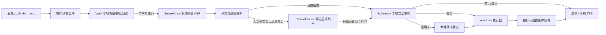
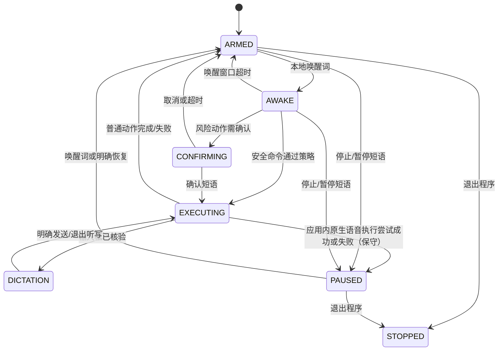

# HandsFreePC 架构

## 目标与非目标

HandsFreePC 是 Windows 11 用户会话中的本地优先语音控制器。它解决的是：双手被占用时，用自定义唤醒词打开文件、切换应用、进入指定对话、可靠听写，并在每一步给出可见或可听反馈。

它不是远程桌面、管理员提权工具、通用 RPA 平台，也不是“让 LLM 看着整个桌面随便点”。首版不支持控制锁屏/UAC 安全桌面，不读取密码控件，不执行模型生成的 shell 字符串，不自动完成删除、付款、安装或系统安全设置修改。每个真实动作都要求当前输入桌面为 `Default`，包括 `open_path`。

## 总体数据流



虚线意义上的隐私边界只有“可选云规划器”：本地音频不发送给规划器，但转写后的命令和最小必要上下文会发送。默认配置同时要求 `planner.enabled: false` 和 `privacy.allow_cloud_planner: false`；公开执行默认还是 `execution.dry_run: true`，语音后备默认 `speech.fallback.backend: none`。

## 设计不变量

这些约束比任何单个模型或 UI 选择器更重要：

1. **本地急停但不虚构全面抢占。** `ARMED`/`PAUSED` 用 Vosk 监听停止短语；`AWAKE`/`DICTATION`/`CONFIRMING` 的 endpoint 录音同时逐 block 喂给 Vosk，按高优先级子串命中停止短语即抛出本地控制事件并进入 `PAUSED`。因此听写内容说出完整配置停止短语也可能被当作控制并截断。取消确认等其他控制语仍要完成 SenseVoice 转写；0.1.0 的同步动作和完整 SAPI 队列播放也不能由语音抢占，必须保持短小并在边界处重新检查状态。
2. **确定性优先。** 能用路径解析、应用档案或固定命令完成时，不调用 LLM。
3. **规划与执行分离。** Codex/Claude 的输出是未受信任建议；只有本地白名单执行器能改变桌面状态。
4. **不猜歧义。** 同名路径、多个窗口、多个控件或置信度不足时失败关闭；0.1.0 没有交互式候选问答，用户需重新说得更具体。
5. **输入前核验。** 激活目标时验证允许的进程名/标题；进入听写时固定非密码 Edit/Document 身份，之后每段 `TYPE_TEXT` / `SEND_PROMPT` 前重新检查同一 foreground HWND 与该控件身份。它不是每次都重新读取进程镜像、签名或完整性级别。
6. **动作证据按能力分级。** 命名 UIA 点击要求观察到选中/焦点/元素消失或 UI 树变化；搜索热键流程会最终重找命名选中项。但 `TYPE_TEXT` 只证明同一非密码输入控件在输入前仍聚焦、`SendInput` 接受了全部 UTF-16 单元且前台未变；`SEND_PROMPT` 只证明相同目标复核后发送 Enter 且前台未变；原生语音热键/按钮也不能证明麦克风已真正 active。`open_path` 目前只能证明 Windows 接受调度。任何这些证据都不得描述成下游应用端到端完成证明。
7. **最小权限。** 进程以普通用户权限运行，不请求 UIAccess，不尝试同意 UAC。
8. **默认不留内容。** 原始音频和转写默认不落盘，0.1.0 不创建持久化的运行内容日志；诊断 stdout 仍可能含路径，分享前必须脱敏。

## 运行状态机



- `ARMED`：只运行低成本 Vosk grammar 和短预卷缓冲。
- `AWAKE`：采集一条完整命令；超时后自动休眠。
- `EXECUTING`：0.1.0 同步执行一组短动作，期间主识别/控制循环不消费麦克风 block（PortAudio callback 仍可能填充有界缓冲），因而停止短语不能抢占已开始的 OS/UI 调用；每组最多 8 步并在动作边界失败关闭。
- `DICTATION`：把本地 ASR 结果写入已验证的目标输入框；只有带控制前缀、且整句精确匹配的提交命令才触发 `SEND_PROMPT`，否定句不会提交。普通听写中的全局停止短语仍可能优先触发暂停。
- `CONFIRMING`：确认只接受配置短语的完整标准化整句，并有超时；“不要确认执行”等包含确认词的否定句不会授权。
- `PAUSED`：不执行桌面动作；由停止/暂停短语或应用内原生语音流程进入。0.1.0 尚未监听 Windows 锁屏/切换用户事件，麦克风不会自动暂停；桌面动作另外通过 `Default` 输入桌面、前台/UIA 和 SendInput 门禁失败关闭。

## 组件与代码边界

### 配置与数据模型

- `handsfree_pc/config.py`：加载默认值和 `config.local.yaml`，展开路径别名，并强制“启用规划器必须同时允许云规划”。
- `handsfree_pc/models.py`：定义 `Action`、`Plan`、风险级别、反馈模式和运行状态。
- `handsfree_pc/schemas/plan.schema.json`：Codex/Claude 共同使用的动作 Schema；禁止未知字段并限制最多 8 个动作。

配置分为 `app`、`privacy`、`speech`、`planner`、`execution`、`apps` 六个命名空间。公开仓库只提交 `config.example.yaml`；本机路径、设备名和应用档案放在被 Git 忽略的本地配置中。公开模板把 `execution.dry_run` 设为 `true`；Codex/Claude 的 `search_hotkey`、`native_voice_hotkey` 设为 `null`，`voice_button_names` 设为空列表，必须本机校准后显式填入。

`dry_run` 只禁止构造/调用真实 Windows 桌面后端，不等于“整个进程无副作用”：直接 `run` 仍会打开麦克风、驱动状态机并显示遮罩/播放 TTS；若 planner 已双重开启，无法确定解析的命令仍可能调用 Codex/Claude 并联网。`simulate` 会强制 dry-run 并使用 no-op feedback，但仍会解析/读取检查本机路径、验证配置热键，也可能在显式启用 planner 后联网。

### 语音层

- 音频入口统一为 16 kHz 单声道 PCM。
- 唤醒器使用 Vosk 小中文模型和很小的 grammar，只负责唤醒、停止等短语。
- 命令识别器使用 sherpa-onnx SenseVoice；公开默认 `speech.fallback.backend: none`。faster-whisper 只是 opt-in 异常后备，普通安装不包含它，只有 `install.ps1 -WithWhisper` 才安装；使用前还应在联网维护窗口预下载 `large-v3-turbo`，避免第一次后备时发生 GB 级下载。0.1.0 仅在已构造 SenseVoice 的 `transcribe()` 抛异常时触发，不处理空/低置信度结果，也不能补救 SenseVoice 启动/加载失败，且尚无该分支的自动化测试。
- 默认 utterance endpoint 是 Silero VAD v6.2.1 ONNX，由现有 sherpa-onnx 运行时加载，并设置阈值、最短静音、最短/最长语音和窗口大小。
- 自适应能量门限是可选后备：根据环境噪声调整阈值，并使用预卷、最短语音、尾部静音和最长话语上限；不需要额外 VAD 权重。

音频缓冲属于短生命周期内存对象。当前 Transcriber 接口只返回文本字符串，不暴露 SenseVoice 置信度；默认不提供“自动保存录音”路径。

### 意图与规划层

`handsfree_pc/intents.py` 先解析高频中文命令，包括：

- 盘符、桌面/文档/下载别名和层级路径；
- 激活 Codex/Claude；
- 打开项目/对话、进入听写或明确打开应用内语音；
- 反馈模式、暂停、恢复和发送。

`handsfree_pc/planner.py` 仅在确定性解析失败且双重配置开关允许时运行。以下列出当前核心 argv；临时文件路径、可选 `--model` 和 stdin prompt 值省略：

- Codex：`codex exec --ephemeral --ignore-user-config --ignore-rules -c shell_environment_policy.inherit=none --sandbox read-only --skip-git-repo-check --output-schema ... --output-last-message ... --color never -C <temp> -`。
- Claude：`claude --safe-mode -p --permission-mode dontAsk --tools "" --output-format json --json-schema ... --no-session-persistence`，cwd 为临时目录。
- 子进程环境会删除名称含 `API_KEY`、`TOKEN`、`SECRET`、`PASSWORD`、`CREDENTIAL` 的变量；这是一层纵深防御，不代表可以把秘密放进命令文本。
- 两个 adapter 都在空临时工作目录中运行，避免自动带入项目级上下文；planner 启动/超时错误会被泛化，不向用户回显原始 prompt 或 provider stderr。
- 两者都不能直接调用 HandsFreePC 的桌面执行器，也不能绕过随后运行的本地安全策略。本地重判从 planner 声明的风险起步，只能保持或升高，不能降低。Claude 的工具列表为空；Codex 的 `read-only` sandbox 仍可运行模型生成的只读 shell 命令，因此临时工作目录不构成本机文件保密边界。云规划保持默认关闭。

### 路径解析与安全策略

`handsfree_pc/paths.py` 的路径解析顺序为：

1. 在任何文件系统访问前阻断 UNC / `//server`、URI 和 Win32 device namespace，变量/别名展开后再检查一次；
2. 展开配置中的显式别名；
3. 完整本地路径存在则直接采用；
4. 对盘符路径逐层精确/模糊匹配；
5. 只在配置的 `search_roots` 内有限深度搜索；
6. 最佳候选过近时抛出歧义，不自动选择。

执行器的 `prepare_plan` 会在确认前解析每个 `open_path`，把最终路径写回计划，再由运行时重新执行 `SafetyPolicy`。因此“安装程序”这类无扩展名说法若最终命中 `.exe`，仍会进入确认，而不会只按原始口令的后缀判级。

`handsfree_pc/safety.py` 对所有来源的计划重新判级。首版动作集合只有：

`open_path`、`activate_app`、`open_conversation`、`open_mode`、`enter_dictation`、`start_native_voice`、`set_feedback_mode`、`type_text`、`send_prompt`、`pause`、`resume`、`wait`。

Schema 中没有 shell、PowerShell、坐标点击、注册表、进程注入、凭据输入或任意脚本动作。已存在目录和窄安全文件后缀可直接打开；未知后缀、无后缀普通文件、任何主动/间接执行类型、应用内原生语音和非显式提交一律升级为确认。`start_native_voice` 必须恰好一次且位于计划最后一步，不能与 `set_feedback_mode` 同一计划；违反即阻断。删除、格式化、付款、转账、输入密码等关键词在首版本地动作计划中直接阻断。

所有 action 文本字段与 plan `summary` 都拒绝 Unicode C 类控制字符；`type_text` 另有 2000 字上限，因此不能夹带 NUL、回车或换行提交。`send_prompt` 只接受完整控制命令带来的显式授权。裸“开始听写/打开语音输入”不能以 `app=current` 写入任意前台框，必须指定已配置的 Codex/Claude 等应用。这里的阻断边界只约束 HandsFreePC 的本地计划：文本一旦由用户明确提交给下游 agent，下游能做什么由其自己的 sandbox、approval 和 permissions 决定，必须另行采用最小权限。

### Windows 执行层

执行器按以下阶梯尝试，不能跳过核验：

1. **原生 handler**：先确认当前输入桌面为 `Default`，再验证路径存在且唯一并通过 Windows 文件关联打开；若没有匹配窗口且配置了应用可执行文件，则从该完整路径启动。已有窗口目前按允许的进程名和标题匹配，尚未核验运行中进程的完整镜像路径或代码签名。0.1.0 对路径打开记录调度方法，但尚未验证最终关联应用内容。
2. **pywinauto/UIA**：首版默认。窗口按应用档案的进程名/标题定位；控件在可见、启用的 UIA 后代中按控件类型和可访问名称做唯一/模糊匹配。`AutomationId` / `RuntimeId` 主要记录为证据，并用于固定已经聚焦的听写目标，不是通用初始 selector。
3. **WinApp CLI adapter**：未来可选。它仍属 Public Preview，因此不会替代 pywinauto 成为首版唯一后端。
4. **局部视觉 adapter**：未来兜底。只允许返回目标窗口局部区域中的候选元素；本地执行器仍要重验位置与窗口。

UIA/输入动作采用两阶段核验：

```text
解析目标 → 唯一候选 → 激活并确认 foreground HWND
        → 获取目标控件 → 再确认窗口未变化 → 调用控件模式/输入
        → 收集该动作实际支持的后置证据 → 成功反馈或失败关闭
```

当目标应用以管理员身份运行而 HandsFreePC 不是管理员时，输入注入可能被 UIPI 阻止。这是安全边界，不通过自动提权规避。

### 应用档案

每个应用档案定义：

- 可执行路径（可选）、允许的进程名和窗口标题；
- 搜索快捷键（若稳定）；
- 项目/对话通过通用命名 UIA 匹配；composer 使用内置候选名和唯一 Edit/Document fallback；
- 原生语音只使用本机显式配置的热键或按钮名称。

Codex/Claude 这类 Electron 应用的 UIA 树可能随版本、语言和实验功能变化。0.1.0 没有内置 `inspect` 命令，也没有版本化 selector profile；应用升级后应使用外部 UIA/辅助功能检查器做本机校准，再运行 dry-run 和受控 live smoke。

公开档案有意不预填 Codex/Claude 的搜索热键、原生语音热键或语音按钮名称；它们的 live UI 选择器尚未验证。没有本机 UIA 校准时，相关动作应失败，而不是猜一个按钮。

## 听写与应用内语音

默认流程是“HandsFreePC 听写”，而不是点击应用自己的麦克风：

1. 激活 Codex/Claude；
2. 找到并验证目标项目、对话和 composer；
3. 进入 `DICTATION`；
4. 本地 ASR 分段写入 composer；
5. 用户说出带控制前缀的完整整句“电脑发送提示”后才提交；“电脑不要发送提示”等否定句作为听写文字，不会提交。

这样默认只有一套麦克风状态机，能避免 TTS 回声并保留发送前检查。`start_native_voice` 只响应用户明确要求，属于需确认动作，并被限制为计划最后一步且不能与反馈模式切换组合；非法组合在执行前阻断、回 `ARMED`，按当前反馈模式报错。合法计划经确认后，执行前先等待此前的整个 TTS 队列播放并清空；一旦开始执行尝试，执行中、成功和失败反馈都强制 overlay-only，成功或失败都保守进入/保持 `PAUSED`，因为按钮/热键失败不代表第三方麦克风一定未被部分触发。说唤醒词可返回 HandsFreePC；项目不能验证第三方麦克风是否 active 或何时真正结束，所以用户应先在屏幕上核实并结束对方语音。

## 反馈层

- `overlay`：默认；topmost、高对比、大字、不可聚焦、鼠标穿透，不能抢走 composer 焦点。
- `voice`：调用本机已安装的 Windows TTS；`speaking` 覆盖整个待播队列。PortAudio callback 仍向有界输入队列/预卷写入，但运行时暂停识别与命令处理；全部播放后两处缓冲一起丢弃。0.1.0 不能用停止词中断这段队列播放，所以反馈只应是短句。SAPI worker/COM 错误当前不会传播成可见失败，纯 `voice` 模式可能静默，必须逐机感知测试；默认 `overlay` 更安全，`both` 至少保留遮罩。
- `both`：同时显示和朗读。
- `silent`：普通反馈不显示、不朗读；确认和错误会强制显示遮罩，避免静默执行或静默失败。

确认文案不信任 plan `summary`，而从已校验动作本地派生；路径动作的普通执行/失败也使用通用摘要，不朗读最终绝对路径。但非确认执行和部分 blocked 流程仍可能显示/朗读未受信任、最长 200 字的 plan `summary`，这是误导反馈残余风险。命令刚识别时，`overlay` / `both` 还会显示完整的“识别：{转写}”，`voice` / `both` 会朗读它，因此口述路径/项目名仍可能暴露给旁观者。反馈链路是半双工：必须等待唤醒/确认 TTS 队列结束再说下一句，否则缓冲会在播放后丢弃。诊断命令的 stdout/JSON（例如 `doctor`）也可能显示配置路径和模型路径，用户在分享输出前必须脱敏。

## 常驻与自启

0.1.0 以当前用户登录后的普通进程运行。`scripts/install-autostart.ps1` 会在当前用户的 Startup 文件夹创建 `HandsFreePC.lnk`，目标是项目虚拟环境中的 `pythonw.exe`，并传入本机 `config.local.yaml`；它不安装 Windows Service，也不请求管理员权限。`scripts/run.ps1` 会先跑 `doctor --strict`，但直接执行 `handsfreepc run` 和 Startup 快捷方式不会先跑这道门禁。

这个简单的 Startup 快捷方式没有严格 doctor 门禁、console、持久日志、托盘状态、失败通知、延迟启动、崩溃重启或重复实例仲裁；模型/麦克风/配置的启动异常可能表现为静默退出，因此不能把这些能力写成当前保证。后续安装器可以在经过测试后改用当前用户的 Task Scheduler `ONLOGON` 任务或受 Windows 设置管理的 `StartupTask`，并补上单实例、有限重启和可见卸载。不要改造成试图在 Session 0 中操控交互桌面的服务。

## 可扩展点

新增能力应通过窄接口扩展：

- 新 ASR：实现统一转写接口，不改变安全策略；
- 新 planner：只返回现有/经审查扩展后的 Schema；
- 新应用：新增版本化 profile 和 smoke test；
- 新动作：同时增加模型、Schema、风险矩阵、执行器、后置条件和测试；
- 新反馈：不得抢焦点或把敏感内容发往网络。

任何扩展如果需要任意 shell、全屏云视觉、管理员权限或后台发送外部消息，都属于新的威胁模型，不能用一个配置开关悄悄加入。

## 当前 alpha 边界

- 目标平台是 Windows 11、64 位 Python 3.11 或 3.12（`>=3.11,<3.13`）。
- 当前默认执行适配器是 pywinauto/UIA；WinApp CLI 和视觉定位属于后续可选能力。
- Silero VAD 与能量门限都会受远场、电视、婴儿声和麦克风自动增益影响；应在实际房间分别做误唤醒、漏唤醒和切句回归，不能只依赖上游示例。
- `open_path` 的 `success` 只表示 Windows 接受打开请求；关联应用是否启动并展示正确文件仍需人工观察或未来的应用级 verifier。
- 0.1.0 没有主动的会话锁定事件监听器，麦克风采集不会自动暂停；但每个真实 OS/UI 动作都会读取输入桌面名称，非 `Default` 时连 `open_path` 也阻断。用户仍应在锁屏前说停止短语或退出程序。
- Codex/Claude 应用 UI 必须在目标机器上做 live smoke test；自动化单元测试不能证明某个未来版本的按钮仍可访问。
- 发布机已通过 SenseVoice 官方样例、Vosk 合成唤醒/停止、Silero 官方样例、16 kHz 麦克风读取、完整本地运行时启动/停止、短 SAPI、遮罩不抢焦点、`examples` 目录 Explorer dispatch、`Default` 输入桌面和 Codex 订阅 planner；Claude 清洗环境后的订阅 OAuth 当前不可用。多 DPI、真实家庭噪声和 Codex/Claude live UI selectors 仍未验证。
- 锁屏/Winlogon/UAC 安全桌面、密码框和更高完整性窗口按设计不可控制。
